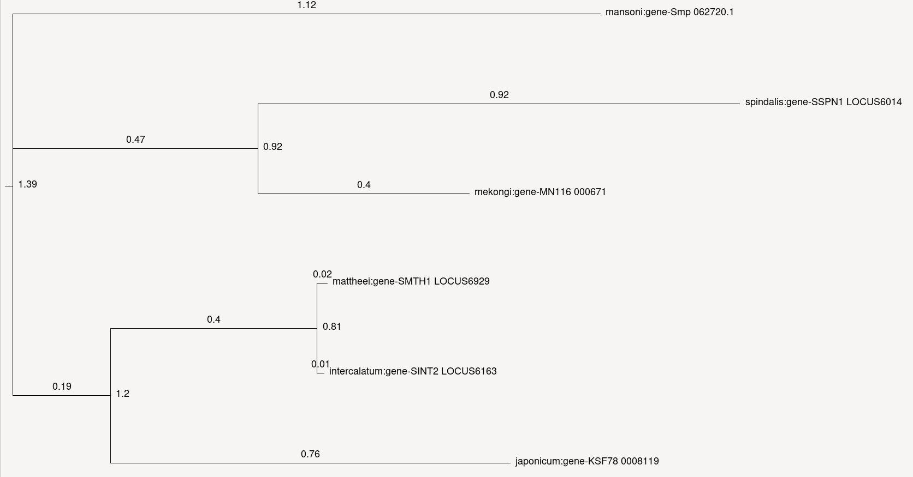
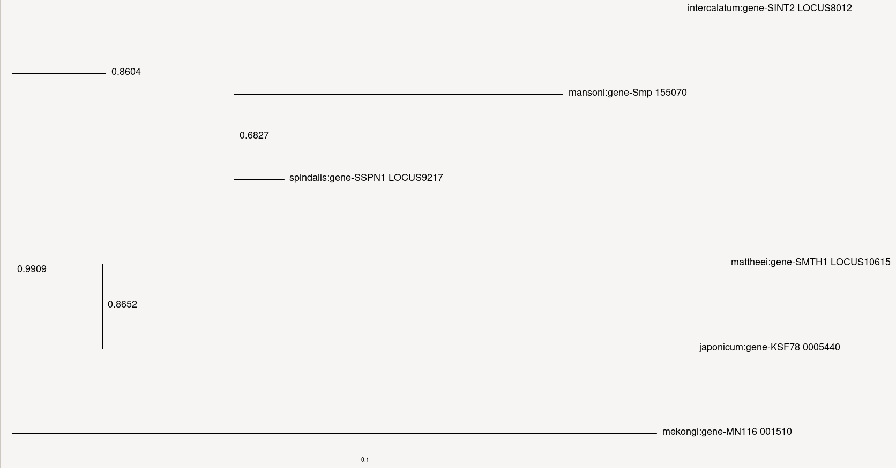
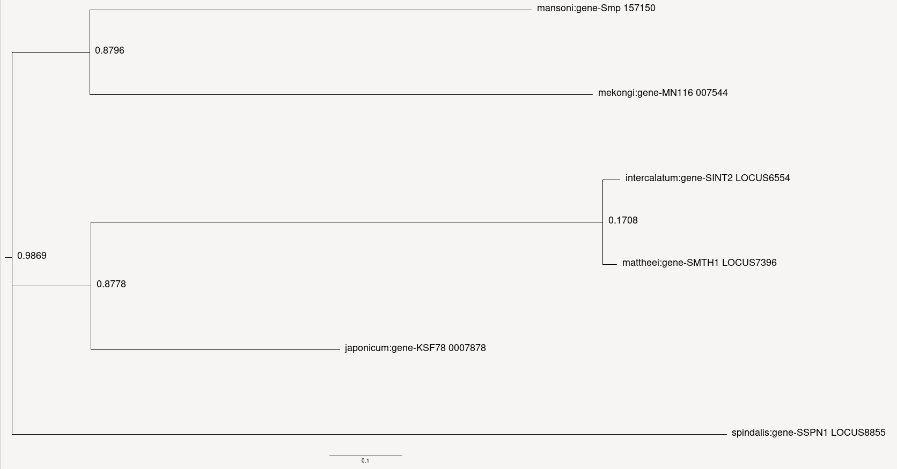
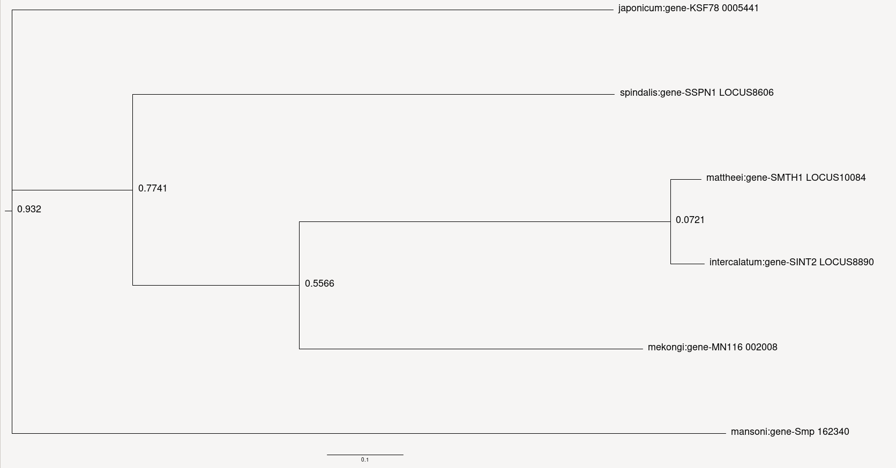
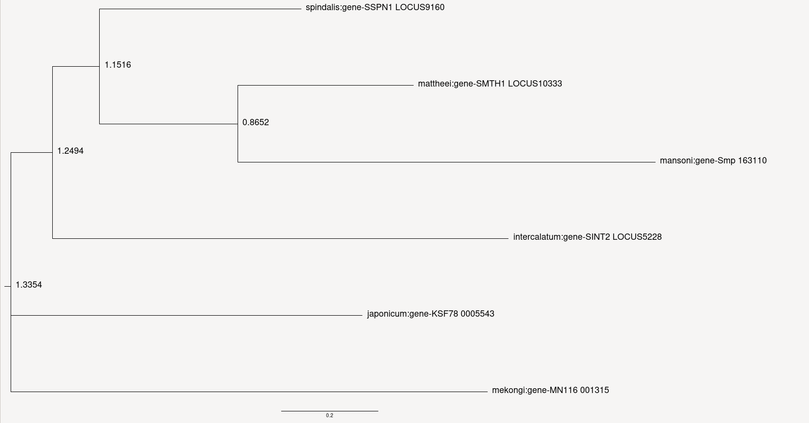
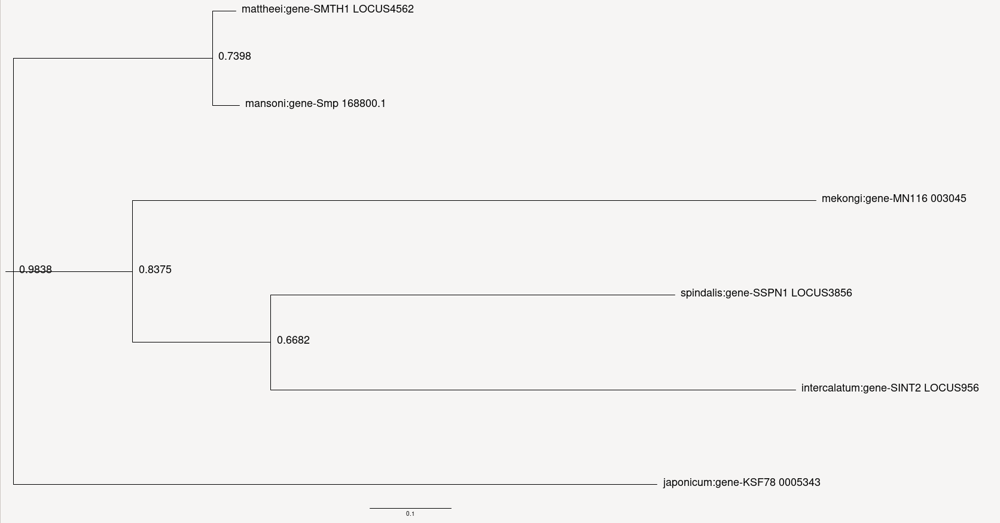
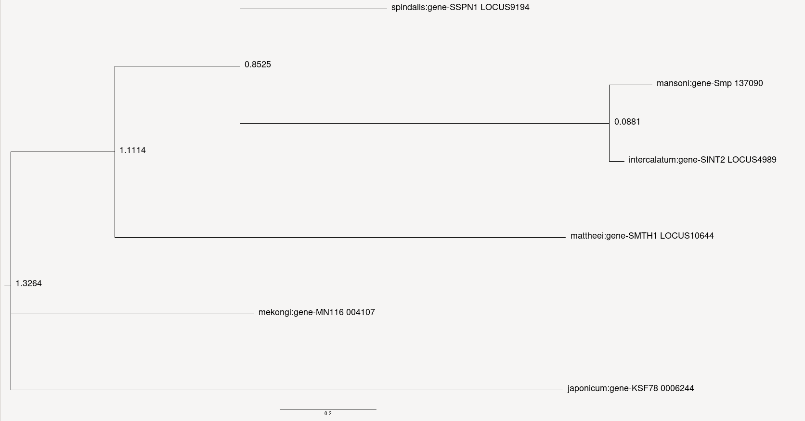
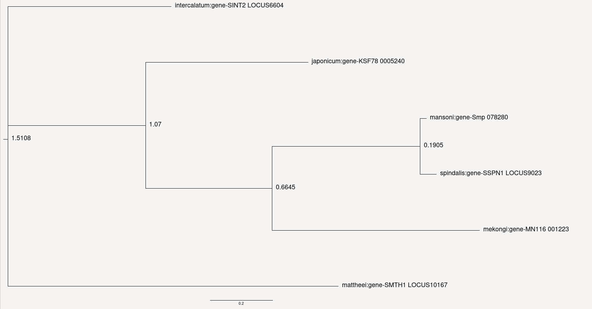

# Проект по биоинформатике (Команда 9)

### Род: Schistosoma
### Команда: 9
### Индивидуальные проекты:
| Имя               |      организм            | ссылка на личный проект |
|-------------------|:------------------------:|:----:|
| Мкртчян Яков      | Schistosoma spindalis    | [github](https://github.com/yakovtmol/bioinf_project) |
| Моисеев Артём     | Schistosoma japonicum    | [github](https://github.com/armoiseev22/bioinf_project_individual) |
| Кобаидзе Степан   | Schistosoma bovis        | [github](https://github.com/Stepansteid/bioinfa_project) |
| Сайфудинов Марат  | Schistosoma mattheei     | [github](https://github.com/kudi808/bioinf_project) |
| Осипов Алексей    | Schistosoma haematobium  | [github](https://github.com/IzyGolstein) |
| Воронко Алексей   | Schistosoma mansoni      | [github](https://github.com/Alleksey5/bioinf_proj)  |
| Варенов Андрей    | Schistosoma intercalatum | [github](https://github.com/0andrejj0/bioinf-project) |
| Лукачик Владислав | Schistosoma mekongi      | [github](https://github.com/vladl2802/bio25-project) |

[Вступительная презентация](https://docs.google.com/presentation/d/1dEg5m09Ou5fLq66mmTET-Pc5kM6i8EZ-/edit?usp=sharing&ouid=111170523725732385002&rtpof=true&sd=true)

[Финальная презентация](https://docs.google.com/presentation/d/1LRJV4G3tfidIk7cvO3JQpLVaJcbY01DF/edit?slide=id.g35b953ee939_0_0#slide=id.g35b953ee939_0_0)

### Выравнивания генов, отвечающих за эпигенетику:

                                                                                          

                                                                                          

